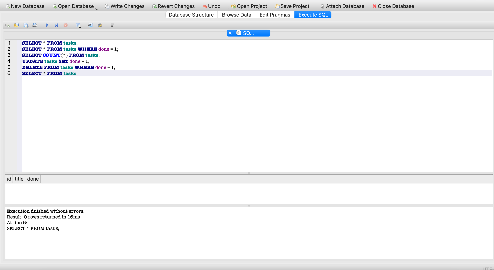

# BE-A2-Connecting-to-the-database
FlyRank AI Backend Engineering W3 Assignment (A2)

# Connecting Your CRUD API to SQLite Database

This repository moves the in-memory task management CRUD API to a persistent SQLite database built with **FastAPI** and **SQLModel**.

---

## Why SQLite?

SQLite was chosen for this project because:
* **Zero Configuration:** It runs serverless as a single file without needing complex database server setup.
* **Persistence:** Data survives server restarts because all rows are written directly to disk (`tasks.db`).
* **Lightweight & Portable:** Simple to clone, run, and evaluate on any machine with zero external dependencies.

---

## Database Location & Setup

* **Database File:** `tasks.db` lives in the project root directory.
* **Automatic Creation:** `tasks.db` and the `tasks` table are created automatically on startup if missing.
* **Seeding:** On the very first run (when the table is empty), three default tasks are seeded. Restarting the application will **not** duplicate these tasks.
* **Git Ignored:** `tasks.db` is included in `.gitignore` so every new clone starts with a clean database state.

---

## Quickstart

Run the single command below to start the server:

```bash
fastapi dev
```

Then navigate to `http://127.0.0.1:8000/tasks` in your browser or test using `curl`:

```bash
curl -i [http://127.0.0.1:8000/tasks](http://127.0.0.1:8000/tasks)
```

---

## Stage 4: SQLite Exploration

During Stage 4, `tasks.db` was opened directly in **DB Browser for SQLite**.

### Example SQL Query Executed
```sql
SELECT * FROM tasks;
```
* **Result:** Returned nothing, accurately representing the final state of deleting all completed tasks in the database.

---

## Database View Screenshot


